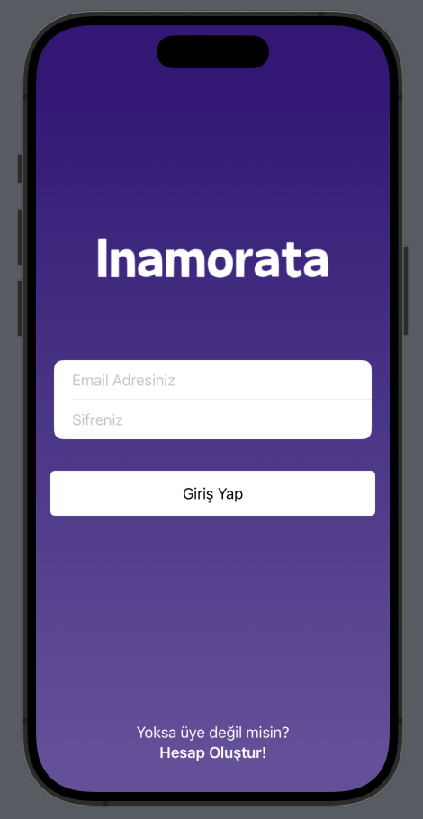
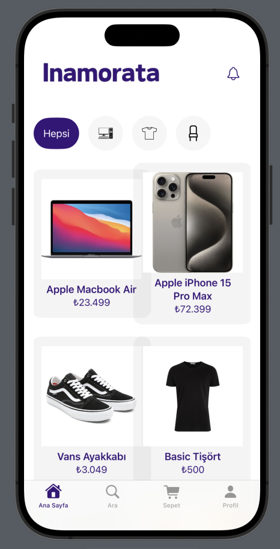
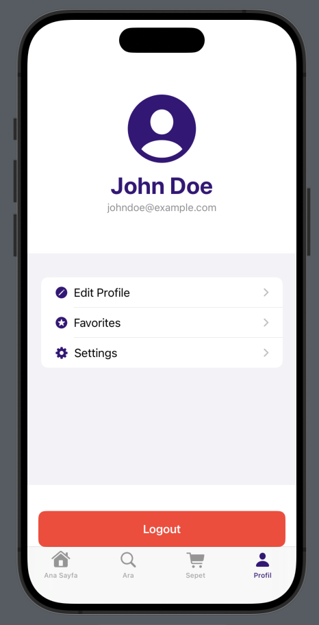
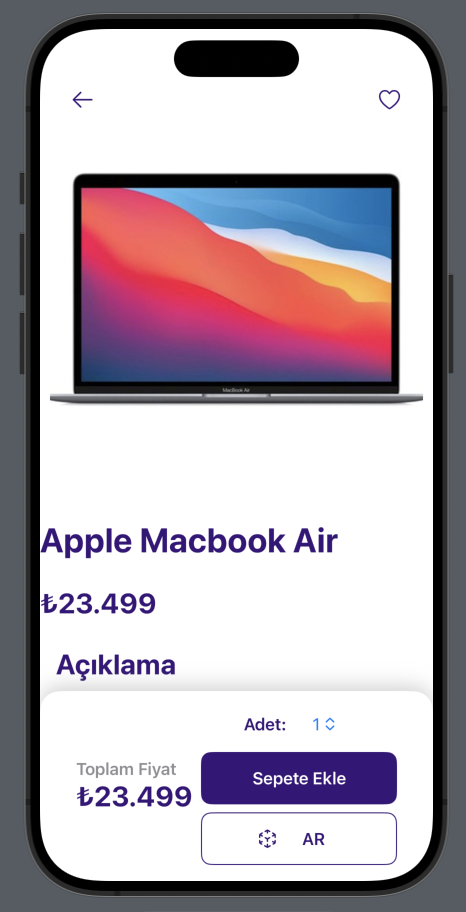
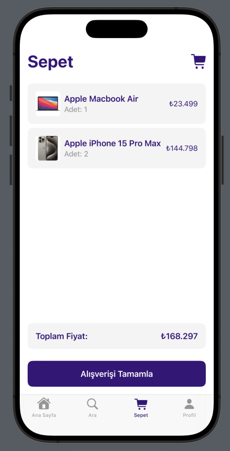
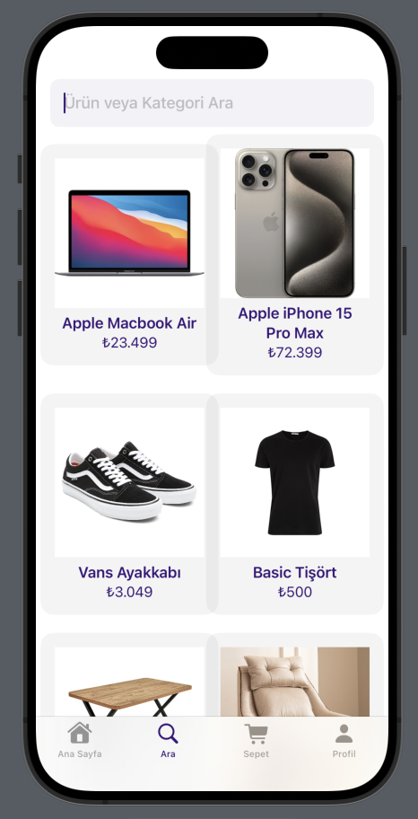

# InamorataShoppingApp

# Project Purpose:

This project is a mobile shopping application aimed at providing users with a more interactive shopping experience using Augmented Reality. It was developed as a final year undergraduate project.

## Content:
- The application is written in Swift.
- Firebase technology is used as the database.
- ARKit library and SwiftUI framework are utilized.
- The entire project was developed by me.
- There are still some issues that need to be addressed.

## Project Interface Screenshots:

